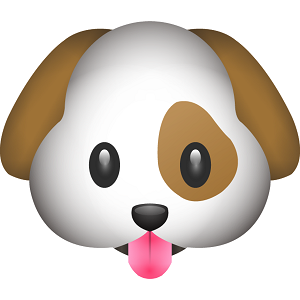

# img2emoji

#### Membre: Yutong YAN, Sixiang XU, Heng ZHANG

---
## Cahier de charge

Ce projet vise à **détecter les objets dans une image** et **faire la mise en correspondance avec les emojis**.

Par exemple, l'entrée de système:

 

Et ce qu’il va donner ça en sortie:

 

## Etapes principles

1. Prendre une image par webcam ou une image locale.
1. Effectuer la détection d’objet dans l’image en utilisant l’approche réseaux neuronaux convolutif.
1. Mettre en correspondance entre les objets trouvés et les emojis.
1. Afficher les emojis sur l’interface graphique.

## Prototype d’interface
 

## Enjeux du projet
1. Permets de **détecter plusieurs classes d’objets**(personne, chat, chien, etc).
1. Permets de réaliser un système **en temps réelle **(plus que 24 image traitée chaque second).
1. Permet de réaliser une interface graphique simple et concis.

## Répartition des tâches
- Sixiang XU: interface graphique en PyQt;
- Heng ZHANG: réaliser l'implémentation de CNN;
- Yutong YAN: mettre en correspondance entre les objets trouvés et les emojis.

## Compétences acquis
1. Language utilisee: **Python**
1. Bibliotheque de l'interface: **Qt**
1. Algorithme principe: **CNN**, **YOLO**