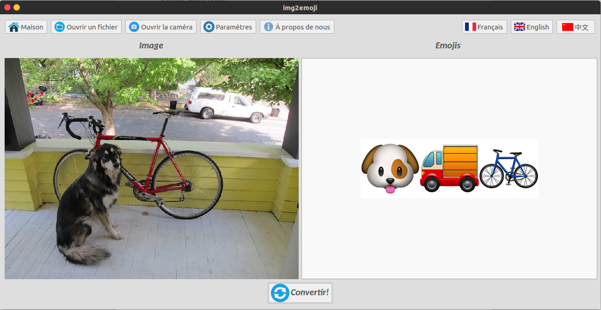
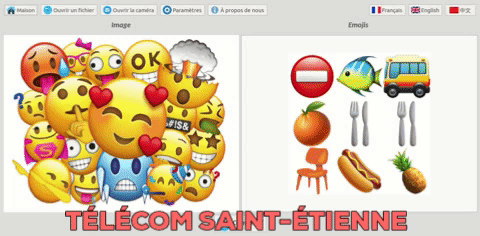
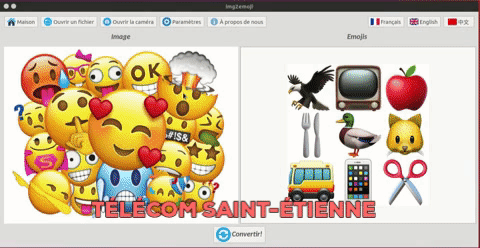
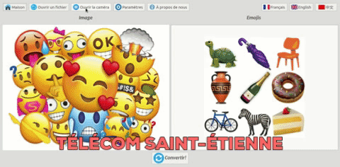
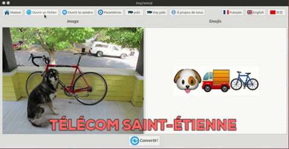

# Install img2emoji

## Introduction

<p align="center">
    
</p>

This project aims to **detect objects in an image** and **match detected objects with emojis**.

## Home page

When you launch the application, there will be an animation effect: the emojis will appear or disappear randomly.

<p align="center">
    
</p>

## Image mode

<p align="center">
    
</p>

## Webcam mode

<p align="center">
    
</p>

## How to use it

<p align="center">
    
</p>

1. Take an image by webcam or a local image.
2. Perform object detection in the image using the convolutional neural network approach.
3. Match between detected objects and emojis.
4. Show emojis on the graphical interface.

## Installation

- Install `PyQt`;
- Modify the `Makefile` file according to your environment.
```
GPU=1		# 0 if your pc doesn't support CUDA
CUDNN=1		# 0 if your pc doesn't support CUDNN
OPENCV=1	# 0 if your pc doesn't support OPENCV
```
- `make` the project;
- Download `yolo.weights` and `tiny-yolo.weights` by running:
```bash
wget https://pjreddie.com/media/files/yolo.weights
wget https://pjreddie.com/media/files/tiny-yolo-voc.weights
```
- If you want to detect one image, run:
```bash
python yolo_detection.py filename
```
for exemple:
```bash
python yolo_detection.py data/dog.jpg
```
- If you want to detect more than one images, run:
```bash
python yolo_detection.py filename1 filename2 filename3 ...
```
- If you want to run the interface program, run:
```bash
python img2emoji.py
```
## Documents

- [Cahier de charge](https://github.com/ZHANGHeng19931123/img2emoji/blob/master/doc/Cahier_de_charge.md) 
- [Presentation slide](https://docs.google.com/presentation/d/12qwRl2qdpB4ghOJ1CvA9NAj-et_QXNDDF5C4GTyw5pk/edit?usp=sharing)
- [Technique repport](https://docs.google.com/document/d/1uj00S5DDjxeMVkpO6LNUv8aBXqm-jEpq2iRJklv9fqo/edit?usp=sharing)

## Team membres

- [Yunyun SUN](https://github.com/syyprime) , [Yutong YAN](https://github.com/melodiepupu) , [Sixiang XU](https://github.com/soarodo) , [Heng ZHANG](https://github.com/ZHANGHeng19931123).

<p align="center">
    
</p>

## Reference

This project is based on [darknet](https://github.com/pjreddie/darknet).
